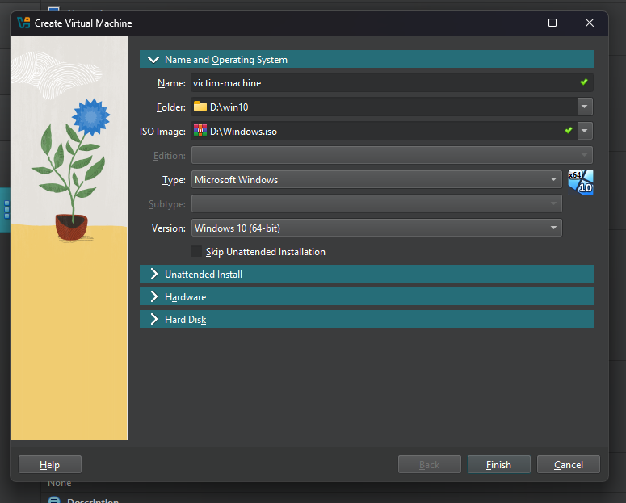
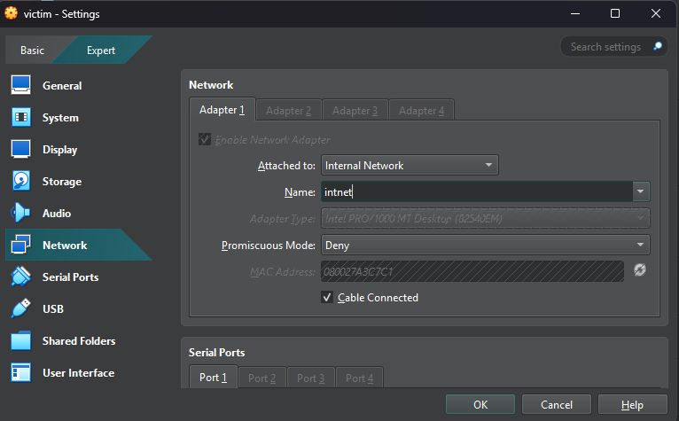
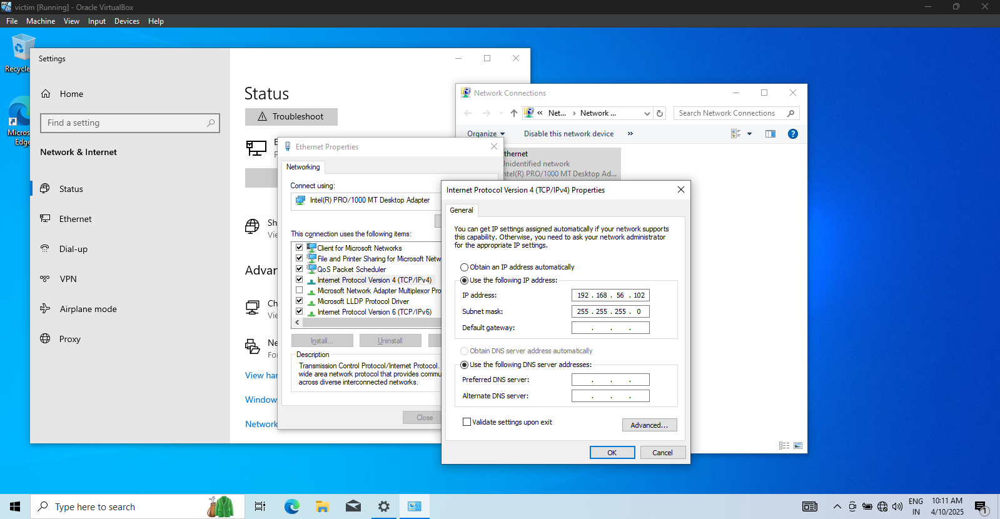
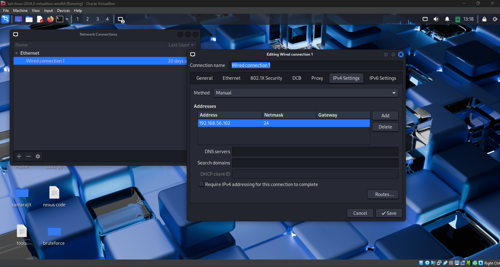
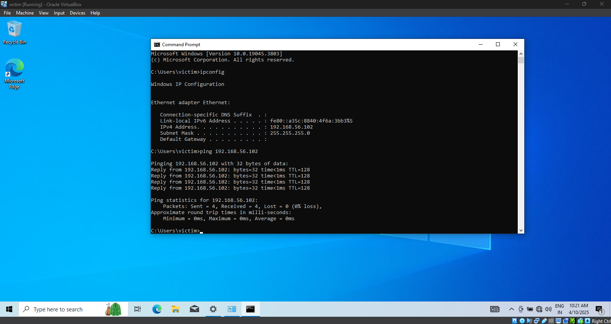
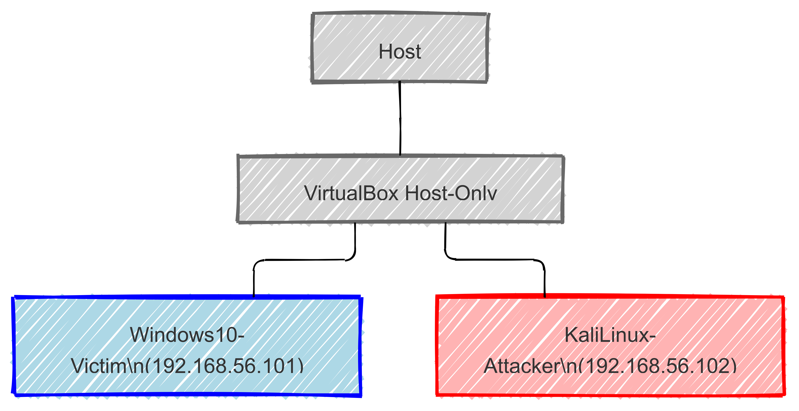

# 🏠 Home Lab Setup: Windows 10 (Victim) & Kali Linux (Attacker)

  

Welcome to the **Home Lab Setup** project! This repository demonstrates how to build an isolated lab environment in VirtualBox to simulate a real-world network for security testing. In this lab, Windows 10 acts as the *victim machine* while Kali Linux is the *attacker machine*. This environment is ideal for practicing ethical hacking, vulnerability assessments, and network experiments.

---

## 📑 Table of Contents

- [🏠 Home Lab Setup: Windows 10 (Victim) \& Kali Linux (Attacker)](#-home-lab-setup-windows-10-victim--kali-linux-attacker)
  - [📑 Table of Contents](#-table-of-contents)
  - [🎯 Project Objectives](#-project-objectives)
  - [📋 Prerequisites](#-prerequisites)
  - [🔧 VirtualBox Environment Setup](#-virtualbox-environment-setup)
    - [Install VirtualBox](#install-virtualbox)
    - [Create Virtual Machines](#create-virtual-machines)
      - [Windows 10 (Victim Machine)](#windows-10-victim-machine)
      - [Kali Linux (Attacker Machine)](#kali-linux-attacker-machine)
  - [🌐 Network Configuration](#-network-configuration)
    - [Host-Only Network](#host-only-network)
    - [Internal Network](#internal-network)
    - [IP Address Setup](#ip-address-setup)
  - 
    - [🎨 Visual Network Diagram](#-visual-network-diagram)
- [🌐 Internal Network Connectivity](#-internal-network-connectivity)
  - [🚀 Why Use an Internal Network?](#-why-use-an-internal-network)
  - [⚙️ Connectivity Details](#️-connectivity-details)
  - [📖 Next Steps](#-next-steps)

---

## 🎯 Project Objectives

- **Real-World Simulation:**  
  Create an isolated and controlled network environment to practice vulnerability assessments and penetration testing.

- **Windows 10 (Victim Machine):**  
  Emulate a typical endpoint that might be attacked, ideal for understanding defense mechanisms.

- **Kali Linux (Attacker Machine):**  
  Employ a robust platform loaded with security testing tools for ethical hacking.

- **Secure Network Setup:**  
  Utilize VirtualBox networking options (Host-Only or Internal Network) to ensure safe, isolated communications between machines.

---

## 📋 Prerequisites

Before getting started, make sure you have:

- **Hardware & Software:**
  - A computer with adequate resources (RAM, CPU, storage) for multiple VMs.
  - [VirtualBox](https://www.virtualbox.org/) installed.
  - ISO images for **Windows 10** and **Kali Linux**.
  - Familiarity with networking basics (IP addressing, subnet masks, gateways).

- **Networking Tools:**
  - Utilities for network monitoring such as `ifconfig`/`ipconfig` and VirtualBox’s network settings.

---

## 🔧 VirtualBox Environment Setup

### Install VirtualBox

1. **Download & Install:**  
   - Visit the [VirtualBox download page](https://www.virtualbox.org/) and install the application.
2. **Launch VirtualBox Manager:**  
   - Verify installation by opening the VirtualBox Manager.

### Create Virtual Machines

#### Windows 10 (Victim Machine)

- **Configuration Details:**
  - **Name:** `Windows10-Victim`
  - **Type:** Microsoft Windows
  - **Version:** Windows 10 (64-bit)
- **Resource Allocation:**
  - **Memory:** 2-4GB (adjust based on your system)
  - **Storage:** Dynamically allocated disk (at least 50GB)
- **Installation:**
  - Attach the Windows 10 ISO file and follow the installation wizard.

 

#### Kali Linux (Attacker Machine)

- **Configuration Details:**
  - **Name:** `KaliLinux-Attacker`
  - **Type:** Linux
  - **Version:** Debian (64-bit) or select Kali Linux if available.
- **Resource Allocation:**
  - **Memory:** Minimum of 2GB
  - **Storage:** Dynamically allocated disk (around 20-30GB)
- **Installation:**
  - Attach the Kali Linux ISO and follow the installation instructions.

---

## 🌐 Network Configuration

Create a secure, isolated network for VM communication. The options include **Host-Only** and **Internal Network** modes.

### Host-Only Network

1. **Setup:**  
   - In VirtualBox Manager, go to **File → Host Network Manager**.
   - Click **Create** to set up a new host-only adapter.
2. **Configuration:**  
   - Adjust settings (e.g., IPv4 Address, DHCP Server) if necessary.
3. **VM Assignment:**  
   - Attach the host-only network adapter to each VM.

### Internal Network

1. **Setup:**  
   - For complete isolation, select **Internal Network** under each VM’s network settings.
2. **Network Name:**  
   - Ensure both VMs are assigned the same internal network name.

  

### IP Address Setup

Set static IP addresses for both machines:

- **Windows 10 (Victim):**
  - **IP Address:** `192.168.56.101`
  - **Subnet Mask:** `255.255.255.0`
  - **Gateway:** (Optional) e.g., `192.168.56.1` (host adapter)
  
  
  
- **Kali Linux (Attacker):**
  - **IP Address:** `192.168.56.102`
  - **Subnet Mask:** `255.255.255.0`
  - **Gateway:** Same as above if required
  
  

**Connectivity Check:**  
Use `ping` (Windows: `ipconfig`, Kali Linux: `ifconfig` or `ip a`) to verify that both machines can communicate.
  
  
---

### 🎨 Visual Network Diagram

Below is a Mermaid diagram representing the lab network setup:

---

# 🌐 Internal Network Connectivity

Welcome to the **Internal Network** configuration for your virtual lab! In this setup, both the **Windows 10 Victim** and **Kali Linux Attacker** machines use an **Internal Network** in VirtualBox, ensuring a secure, isolated environment for testing and experimentation. 🔒

---

## 🚀 Why Use an Internal Network?

- **🔐 Isolation:**  
  Keeps your lab safely separated from your primary network.

- **🛡️ Enhanced Security:**  
  Protects your systems by preventing external traffic and exposure of vulnerabilities.

- **🧩 Controlled Environment:**  
  Simplifies testing, monitoring, and analysis with predictable network behavior.

- **💻 Custom IP Addressing:**  
  Assign static IP addresses for ease of management and troubleshooting.

---

## ⚙️ Connectivity Details

- **Network Mode:**  
  - **Internal Network**: Both Virtual Machines (VMs) are connected using VirtualBox's Internal Network mode.

- **Static IP Addresses:**  
  - **Windows 10 Victim:** `192.168.56.101`
  - **Kali Linux Attacker:** `192.168.56.102`

- **Benefits of Static IPs:**  
  - Easy connectivity and network troubleshooting.
  - Consistent identifiers for scripting and monitoring.

---

## 📖 Next Steps

Ready to continue building your home lab? Click the button below to proceed to the next part of the setup guide.

--- 

